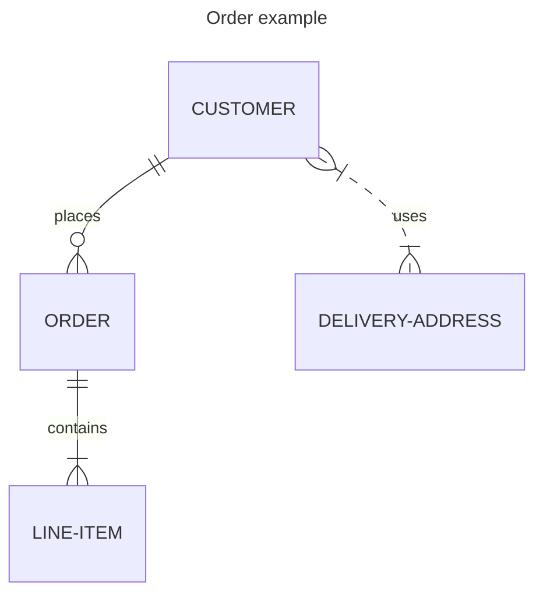

# time-management

## データの概念モデル図

[mermaid](https://mermaid.js.org/syntax/entityRelationshipDiagram.html)で書く

```mermaid
---
title: Order example
---
erDiagram
    CUSTOMER ||--o{ ORDER : places
    ORDER ||--|{ LINE-ITEM : contains
    CUSTOMER }|..|{ DELIVERY-ADDRESS : uses
```
